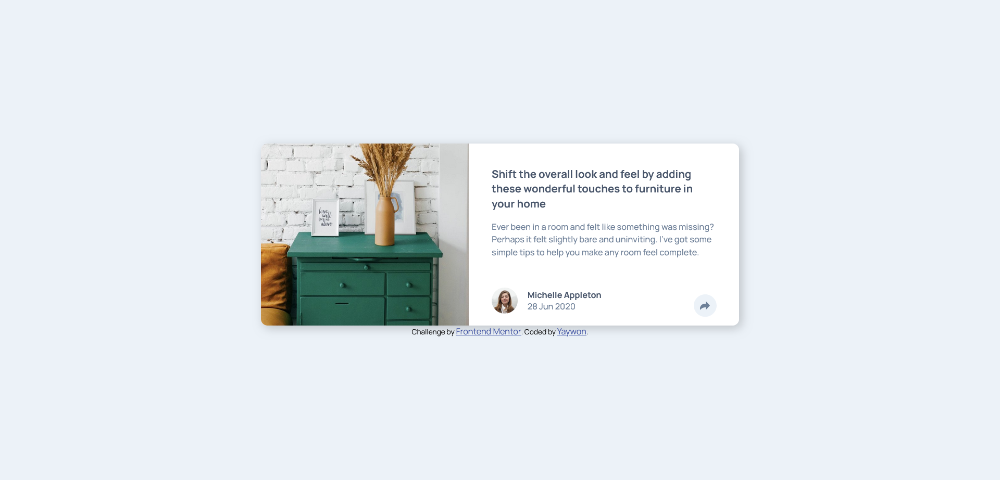

# Frontend Mentor - Article preview component solution

This is a solution to the [Article preview component challenge on Frontend Mentor](https://www.frontendmentor.io/challenges/article-preview-component-dYBN_pYFT). Frontend Mentor challenges help you improve your coding skills by building realistic projects. 

## Table of contents

- [Overview](#overview)
  - [The challenge](#the-challenge)
  - [Screenshot](#screenshot)
  - [Links](#links)
- [My process](#my-process)
  - [Built with](#built-with)
  - [What I learned](#what-i-learned)
  - [Useful resources](#useful-resources)
- [Author](#author)
- [Acknowledgments](#acknowledgments)

## Overview

### The challenge

Users should be able to:

- View the optimal layout for the component depending on their device's screen size
- See the social media share links when they click the share icon

### Screenshot

### Links

- Solution URL: [Solution](https://github.com/yaywonah/Article-Preview-Component)
- Live Site URL: [Live Site](https://yaywonah.github.io/Article-Preview-Component/)

## My process

### Built with

- Semantic HTML5 markup
- CSS custom properties
- Flexbox
- Mobile-first workflow
- Javascript

### What I learned

I learned more about the position property, and I also tried using more custom CSS properties. I had some trouble on figuring out how to make the share class cover the end of the container without leaving space on the bottom, but I tried solving it using the margin property.

### Useful resources

- [YouTube Tutorial](https://youtu.be/ww9q4657UyM?si=qZZHKaaVWSGMY3yv) - This Youtube tutorial was very helpful for figuring out how to use the position property

## Author

- Frontend Mentor - [@yaywonah](https://www.frontendmentor.io/profile/yaywonah)